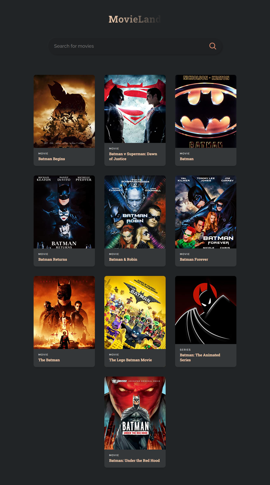

# MovieLand (Movie App)

This is the responsive Simple Movie App built using OMDB API and ReactJS.

It provides list of movies based on the input in the search bar (By default
Batman related Movies are Listed).

<!DOCTYPE html>
<html>
  <head> 
      <meta charset = "utf-8">
   </head> 
  <body>
  

  
 
  
  

  </body>
</html>
